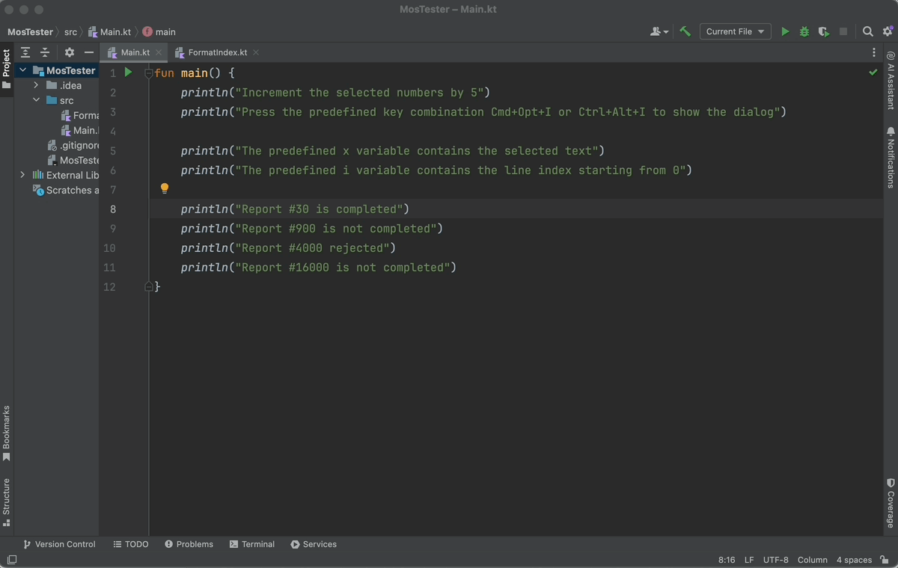
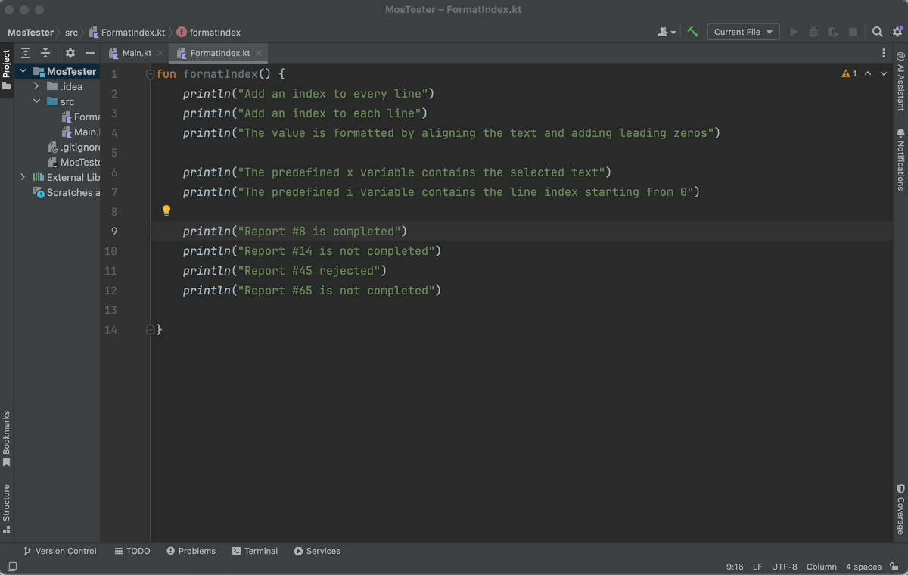

Math On Selection
==

Inspired by the Arithmetic plugin of Sublime Text it is possible to insert the result of mathematical operations into the selection.

There are two predefined variables

- `i` contains the value of the index of the selected line
- `x` contains the numeric value of the selected text

The following functions/packages are available

- the entire Java package [Math](https://docs.oracle.com/en/java/javase/17/docs/api/java.base/java/lang/Math.html)
- the function `format` which is an alias of the function [String.format()](https://docs.oracle.com/en/java/javase/17/docs/api/java.base/java/lang/String.html#format(java.lang.String,java.lang.Object...))

Examples
==

Increment using the selected numbers

</img>

Add index with padding

</img>

Build
==

    ./gradlew buildPlugin

